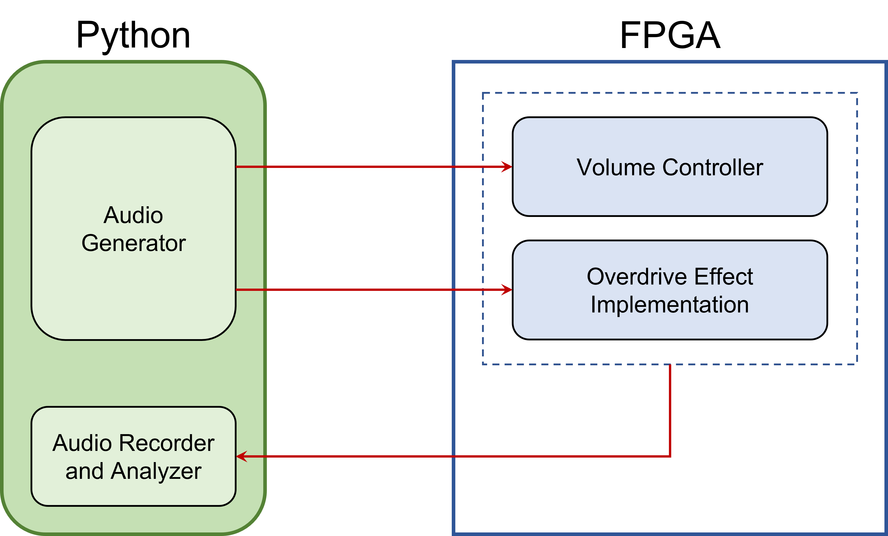

# MAPD_A (Management and Analysis of Physics Dataset - Module A - 2021-2022)

Repository for all the VHDL projects produced during the course.
Disclaimer: since this was an introduction to VHDL there are probably better ways to achieve the same results (still all modules should behave properly).

Vivado_Projects folder: all the exercises proposed during the lab lessons, from the hello_world module to the UART transmitter and receiver. 

Final_Group_Project folder: implementation on a Field Programable Gate Array (FPGA) of a distortion effect in sound waves that is called "Overdrive" or "Clipping". This happens when the amplitude of a soundwave is restricted when it exceeds a given threshold. The resulting sounds are "dirty" and "fuzzy" due to the introduction of high frequency components in the signal. For more information on the project and the group members see the pdf file.

 